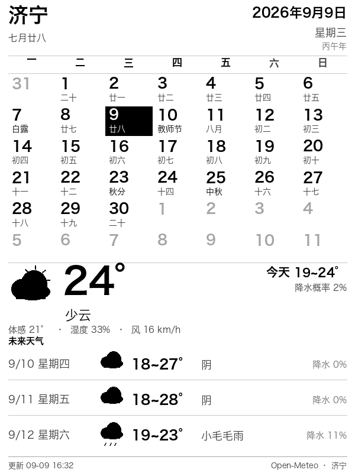

# Kindle 日历天气屏保

把一台吃灰的 Kindle 变成**日历 + 天气信息板**：Mac 端用 Pillow 渲染 600×800 灰度 PNG
（当月月历 + 农历/节气/节日 + 实时天气），Kindle 端拉图并**替换原生休眠屏保**，
休眠时就能看到。

支持定时自动刷新，甚至可以 **RTC 定时唤醒 → 拉新图 → 再睡回去**，
让设备在休眠状态下屏保也保持最新。



---

## 特性

- **原生休眠屏保**：直接替换 `/usr/share/blanket/screensaver/bg_ss*.png`，不依赖 linkss
- **中文日历**：公历月历 + 农历 + 24 节气 + 传统节日（春节/中秋/端午…），离线算法覆盖 1900–2100
- **实时天气**：Open-Meteo（免费、无需 API Key），当前天气 + 未来 3 天，带本地缓存兜底
- **无感自动更新**：图片变了才替换，**不需要重启框架**（已实测），不打断阅读
- **可选定时唤醒**：靠 RTC 闹钟让设备在休眠中每小时自唤醒一次，更新完再睡回去
- **可回退**：一键还原官方屏保；一键卸载自动更新

---

## 适用设备

本方案在 **Kindle 7（2014，第 7 代，型号 WP63GW / 代号 KT2）** 上实机验证：

| 项目 | 值 |
|---|---|
| 屏幕 | 6" E Ink，**600×800**，167 ppi，16 级灰阶 |
| 前置灯 | 无 |
| 固件 | 5.11.1.1 |
| 越狱 | KindleBreak + Universal Hotfix（自带 `sh_integration`） |

**移植到其他机型**需要改三处：

1. `render/dash.py` 里的 `W, H`（换成目标分辨率，如 Paperwhite 是 1072×1448）
2. `kindle/ss-install.sh` 里的 `WANT_W` / `WANT_H`
3. 确认屏保目录路径（多数 5.x 机型都是 `/usr/share/blanket/screensaver/`，
   用 `kindle/diag.sh` 一键探测）

---

## 快速开始

### 1. Kindle 端前置

需要一台**已越狱**且装了**热修复**的 Kindle——它会带来 `sh_integration`：
放进 `documents/` 的 `.sh` 会出现在书库里，点一下就以 root 执行。

详细的越狱与热修复步骤见 **[docs/jailbreak.md](docs/jailbreak.md)**，
设备识别与屏保路径见 **[docs/hardware.md](docs/hardware.md)**。

验证是否就绪：搜索框输入 `;log`，弹出提示框即正常。

### 2. Mac 端部署

```bash
git clone https://github.com/fanzhh/kindle-calendar-weather.git
cd kindle-calendar-weather
bash setup-mac.sh
```

脚本会：找一个带 Pillow 的 Python（没有就建 venv 装）、渲染测试图、
注册 launchd 开机自启，并打印局域网地址。

浏览器打开 `http://<mac-ip>:8099/` 就能预览。

> macOS 防火墙：Kindle 拉不到图时，去「系统设置 → 网络 → 防火墙」允许 Python 接受传入连接。
> LaunchAgent 是**登录后**才启动，Mac 重启后停在登录界面的话需要开自动登录。

### 3. Kindle 端部署

把 `kindle/` 下的脚本拷到 `/mnt/us/documents/`，
把 `config/dash.conf.example` 拷到 `/mnt/us/dash.conf` 并改 IP。

然后在书库依次点：

| 脚本 | 作用 |
|---|---|
| `ota-block.sh` | 屏蔽官方 OTA（连 WiFi 前跑一次，长期有效） |
| `ss-install.sh` | 拉图 → 校验 → 备份 → 替换 20 张屏保 → 完成 |
| `autostart-install.sh` | 安装后台自动更新（upstart 任务） |

按电源键休眠，屏保就是你的日历了。

---

## 配置

`/mnt/us/dash.conf`（改完拔线即生效）：

```sh
DASH_URL=http://192.168.1.10:8099/dash.png
DASH_RESTART=never        # 实测换图无需重启框架
DASH_WIFI=auto            # WiFi 关着时临时打开 8 秒再关回
DASH_INTERVAL=1800        # 刷新检查间隔（秒，最小 300）
DASH_WAKE_INTERVAL=3600   # RTC 定时唤醒间隔（秒；0=关闭）
DASH_AUTO_SUSPEND=auto    # 唤醒后主动睡回；never=交给系统
```

换城市：改 `render/weather.py` 里的 `JINING` 经纬度。

---

## 自动更新是怎么工作的

```
upstart 任务 dash-autoupdate（start on started framework）
   └─ dash-daemon.sh 常驻
        ├─ 主循环：每 60 秒轮询，用挂钟时间判断是否到刷新间隔
        │    （不用 sleep 长间隔：busybox 的 sleep 走 CLOCK_MONOTONIC，
        │      休眠期间不走，唤醒后会白等）
        ├─ 到点则跑 ss-install.sh：下载 → 校验 PNG 头 → 内容有变才替换
        └─ 事件监听：lipc-wait-event 监听 powerd
             ├─ readyToSuspend  → lipc-set-prop -i com.lab126.powerd rtcWakeup <秒>
             └─ wakeupFromSuspend → 开 WiFi → 更新 → eips 把新图画上屏
```

**为什么不能直接写 `/sys/class/rtc/rtc0/wakealarm`**：`powerd` 在休眠的最后阶段会用
它自己的 `rtcWakeup` 覆盖这个值（多数时候是 0，即不唤醒）。必须走 `powerd` 的接口，
且**只能在 `readyToSuspend` 阶段设置**。详见 [docs/pitfalls.md 第 14 条](docs/pitfalls.md)。

**实测数据**（Kindle 7 / 5.11.1.1）：`DASH_WAKE_INTERVAL=600` 时，设备无人触碰情况下
屏保时间能稳定前进，滞后在「唤醒间隔 + 服务器图片缓存」范围内。

**电池**：不唤醒时几乎不耗电；每小时唤醒一次约几十秒清醒，估算 3–5 周。
安全阀：`/mnt/us/DISABLE_DASH_SLEEP` 存在则永不主动休眠；唤醒间隔设 0 可完全关闭该功能。

---

## 为什么不用 linkss / KUAL

这三个坑挡住了常规路线（详见 [docs/pitfalls.md](docs/pitfalls.md)）：

1. **PEKI（新版 KUAL）明确要求固件 ≥ 5.12.2.2**，老固件用不了
2. **linkss（ScreenSavers Hack）的公开下载基本失效**（论坛附件要登录、网盘要客户端）
3. 热修复自带的 **`sh_integration`** 已经能拿到 root 执行权限，自己换屏保反而更干净
   —— linkss 底层做的也是替换 `/usr/share/blanket/screensaver/` 里的图

---

## 让 AI 助手帮你做

不想逐条对着文档操作的话，[PROMPT.md](PROMPT.md) 里有一段可直接复制给 AI 助手
（Claude Code / Cursor / Codex 等）的提示词，让它先诊断设备、再动手部署。

---

## 回退

| 目标 | 操作 |
|---|---|
| 还原官方屏保 | 书库点 `ss-restore.sh` |
| 停掉自动更新 | 书库点 `autostart-remove.sh` |
| 恢复官方更新 | 把 `/etc/uks/pubprodkey01.pem.bak` 改回原名 |

---

## 目录结构

```
├── render/          渲染层（农历 / 天气 / 面板 / 字体）
├── server.py        HTTP 服务：/dash.png、/kiosk、/health
├── setup-mac.sh     Mac 端一键部署 + launchd
├── selftest.sh      端到端自检（不碰 Kindle）
├── kindle/          Kindle 端脚本
├── config/          配置示例
└── docs/            越狱、硬件、踩坑记录
```

---

## 许可

MIT，见 [LICENSE](LICENSE)。
第三方工具的下载链接见 [docs/jailbreak.md](docs/jailbreak.md)，本仓库不打包这些二进制。
